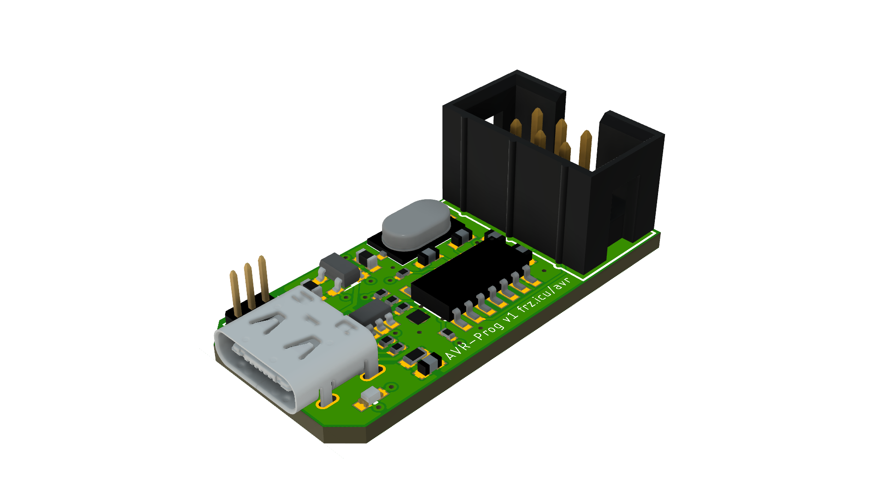

# AVR-Prog
Basic Programmer for AVR-Chips. It's based off the [Sparkfun Tiny AVR Programmer](https://github.com/sparkfun/Tiny-AVR-Programmer).

Features are:
- USB-C connector,
- 5V or 3V3 logic level,
- Tag-Connect connector.

## Partlist

|Name     |Component             |Package                |
|---------|----------------------|-----------------------|
|C1, C3   |100nF Cap             |0603                   |
|C2       |10µF Cap              |0603                   |
|C4, C5   |2.2µF Cap             |0603                   |
|C6, C9   |18pF Cap              |0603                   |
|IC1      |ATTINY84A-SSU         |SOIC127P600X175-14N    |
|J1       |JUMPER 3x 1.27mm      |                       |
|J3       |Box Header 6P         |                       |
|LED      |LED                   |0603                   |
|R1       |1K Resistor           |0402                   |
|R2, R9   |68Ω Resistor          |0402                   |
|R3       |1K5 Resistor          |0402                   |
|R4       |10KΩ Resistor         |0603                   |
|R6, R7   |5K1 Resistor          |0402                   |
|R8       |10K Resistor          |0402                   |
|U$1      |USB-C Connector       |TYPE-C16PIN            |
|U$2      |TLV75533PDBVR         |SOT23-5                |
|U$3      |SRV05-4-P-T7          |SOT23-6                |
|X1       |KMD160001210          |M-49USSMD              |